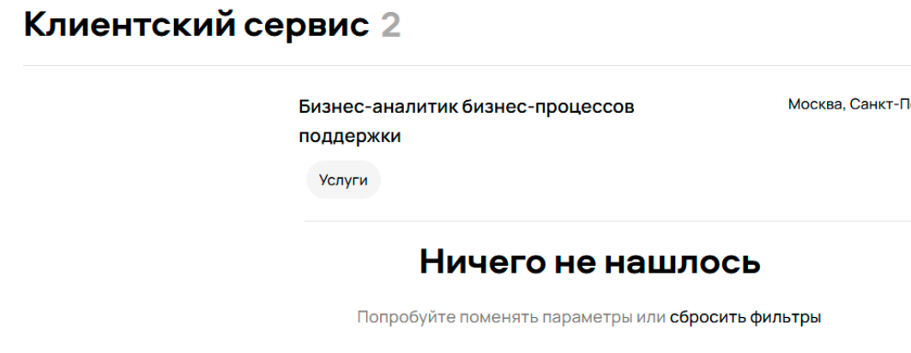
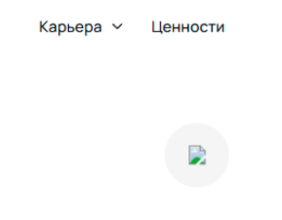
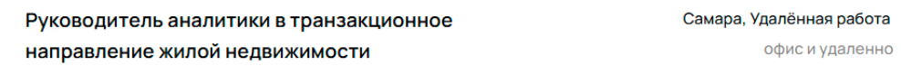
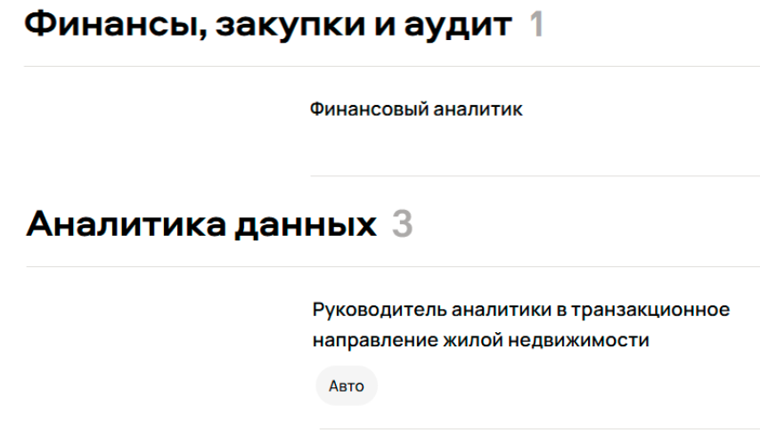

Задание 1 – найти баги на скриншоте страницы, расставить приоритеты. Ниже представлен список найденных багов, их приоритеты и обоснование выбора приоритетов.

Основные критерии качества страницы карьерного сайта:

Верная работа фильтров – пользователь должен получить список вакансий, подходящих по местоположению, специализации и формату работы. Также важно удобство просмотра вакансий.

1.	Не работает фильтрация по городу. Выдача результатов по любым городам, не только по выбранному в фильтре (при выборе г. Санкт-Петербург).

Приоритет High. Высокий приоритет, т.к. существенно нарушает одну из основных функций сайта – поиск работы в заданном городе.

2.	Не работает фильтрация по формату работы. Выдача результатов по всем форматам, не только по выбранному в фильтре (при выбранном фильтре «можно удаленно»).

Приоритет High. Аналогично фильтрации по городу, нарушена важная функциональность сайта.

3.	Ложное срабатывание сообщения об отсутствии найденных вакансий в выдаче направлении «Клиентский сервис». Неверный подсчет количества найденных вакансий в этом же разделе.

Приоритет High. Очень визуально заметный дефект, к тому же может говорить о неправильной логике работы в функции фильтрации. 

4.	Отсутствие изображения в иконке шапки страницы. 

Приоритет Middle. Не влияет на функциональность и удобство для пользователя, но визуально сильно заметно и портит впечатление о компании.

5.	Отсутствие города в выдаче «аналитик данных в бизнес-команду» направлении «Аналитика данных»

Приоритет Middle. Работа фильтра по городам в целом работает неправильно, отсутствие подписи города в этом случае менее критично, но тоже затрагивает основную функцию сайта.

6.	Грамматическая ошибка в подписи «227 вакансий открыто» в нижней части сайта. 

Приоритет Middle. Не влияет на функциональность, но заголовок большой и портит впечатление пользователя о компании.

7.	Отсутствие стрелки на кнопке «про направление» в направлении «Аналитика данных». 

Приоритет Low. Незаметный визуальный дефект.

8.	Город и формат работы находятся в одной строке в некоторых из результатов выдачи.

Приоритет Low. Смешивание подписей разных категорий поиска нелогично, ухудшает удобство просмотра результатов выдачи, к тому же срабатывает только для некоторых из результатов и нарушает единообразие оформления.

9.	Отсутствие отдела вакансии в выдаче направлений «Финансы, закупки и аудит», «Data Science».

Приоритет Low. Нарушает единообразие оформления.

